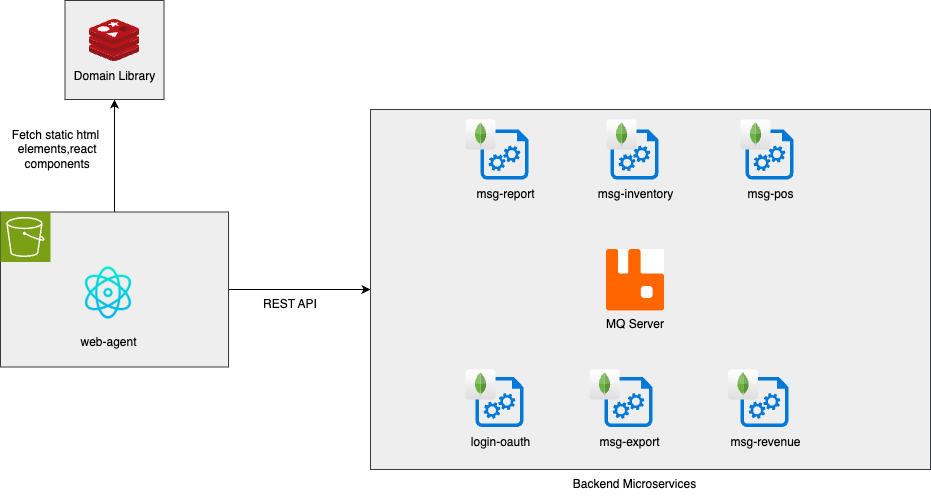

# Inventium - Inventory Management Application

Simplify the need for inventory and point of sales management. It helps businesses by providing the insights of revenue, sales, and inventory in one simple UI.

Integrated with Google spreadsheet, users can export report files to their personal Google Account with ease.

<h2>Frameworks and Technologies Used:</h2>

Go, Htmx, MongoDB, PostgreSQL

  
  
  
  
  
  

<h2>Promgramming Language:</h2>

Go 

  
  

<h2>Application Architecture Diagram</h2>

Inventium frontend microservices is powered by React, React Components and React Router. Backend microservices are written in mostly Typescript and powered by NodeJs. Some of them are in Go.

Redis was utilized for frontend static html elements.

MongoDB was used for most microservices, including login-oauth, reports, inventory, etc.

 

